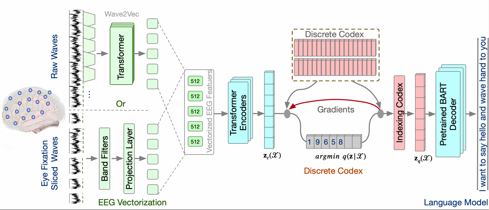
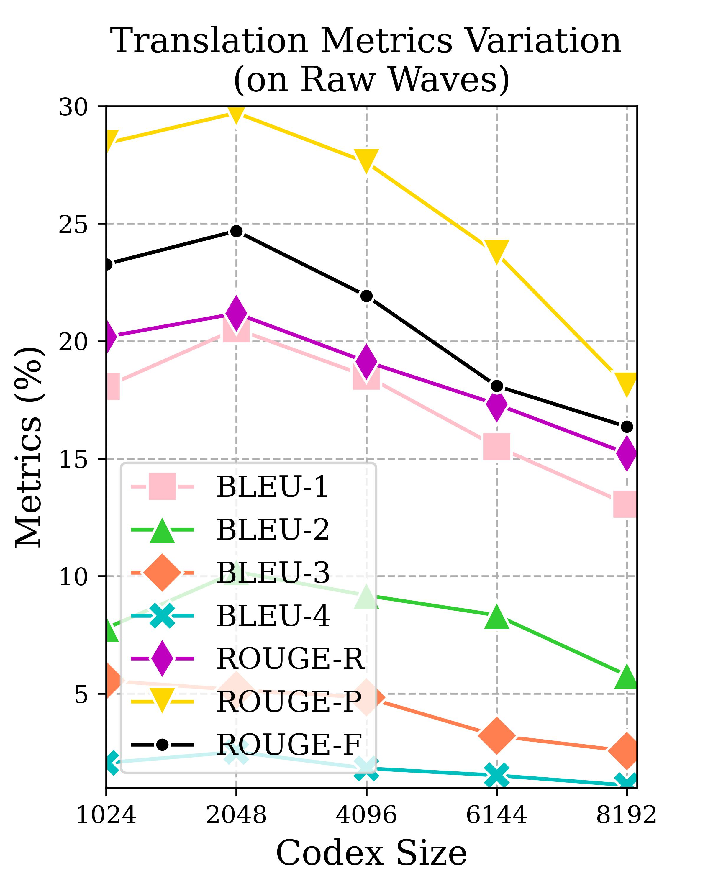
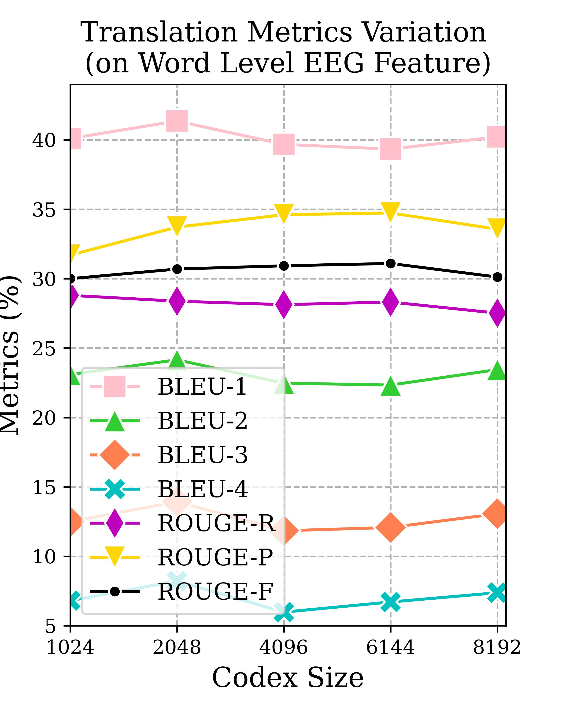
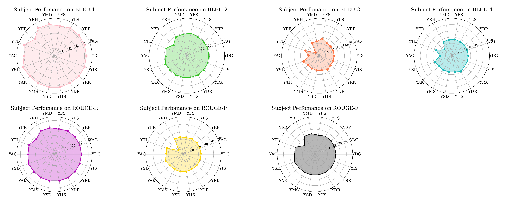

# DeWave: Introducing discrete coding into EEG to text translation

Updates: As the baseline methods make a new claim of evaluation https://github.com/MikeWangWZHL/EEG-To-Text/issues/5, we are investigating this problem and its potential effects. We will update a new paper discussing the evaluation settings as well as possible solutions towards the right evaluation. 

## Citation
```shell
@inproceedings{duan2023dewave,
  title={DeWave: Discrete Encoding of EEG Waves for EEG to Text Translation},
  author={Duan, Yiqun and Zhou, Charles and Wang, Zhen and Wang, Yu-Kai and Lin, Chin-teng},
  booktitle={Thirty-seventh Conference on Neural Information Processing Systems},
  year={2023}
}
```

This repo is the implementation of paper xxx which is a discrete encoding (VQ-VAE) into EEG waves to text translation.
Please take a look at our paper for more technology details. The overview of the model structure is illustrated below.



This repo is based on the [EEG-to-Text](https://github.com/MikeWangWZHL/EEG-To-Text) codes & implementation. 


## Results

Generated sample:

|              | Sample                                                                                                                                                                                                                                          |
|--------------|-------------------------------------------------------------------------------------------------------------------------------------------------------------------------------------------------------------------------------------------------|
| Ground Truth | Bush attended the University of Texas at Austin, where he graduated Phi Beta Kappa with a Bachelor's degree in Latin American Studies in 1973, taking only two and a half years to complete his work, and obtaining generally excellent grades. |
| Prediction   | was the University of California at Austin in where he studied in Beta Kappa in a degree of degree in history American Studies in 1975. and a one classes a half years to complete the degree. and was a excellent grades.                      |

Due to current training, the model could achieve the best peformance on codex size 2048 and latent size 512. The results are revealed as below. 

 

The subject wise results in task 2.0 on BLEU and ROUGE scores. The text ground truth is the same for each subject, so the metrics difference is not that large. 
For example we visualize the model trained by subjec id "YMD".




| Subject |        YDG        |        YAG        |        YRP        |        YLS        |        YFS        |        YMD        |        YRH        |        YFR        |        YTL        |        YAC        |        YSL        |        YAK        |        YMS        |        YSD        |        YHS        |        YDR        |        YRK        |        YIS        |
|:-------:|:-----------------:|:-----------------:|:-----------------:|:-----------------:|:-----------------:|:-----------------:|:-----------------:|:-----------------:|:-----------------:|:-----------------:|:-----------------:|:-----------------:|:-----------------:|:-----------------:|:-----------------:|:-----------------:|:-----------------:|:-----------------:|
|  BLEU-1 |           44.25   |           44.25   |           44.25   |           44.25   |           44.05   |           44.25   |           44.25   |           43.41   |           44.25   |           44.03   |           44.45   |           44.25   |           44.25   |           44.25   |           44.25   |           44.18   |           44.25   |           44.25   |
|  BLEU-2 |           25.83   |           25.83   |           25.83   |           25.83   |           26.11   |           25.83   |           25.83   |           24.58   |           25.83   |           25.55   |           26.04   |           25.83   |           25.83   |           25.83   |           25.83   |           25.86   |           25.83   |           25.83   |
|  BLEU-3 |           15.18   |           15.18   |           15.18   |           15.18   |           15.38   |           15.18   |           15.18   |           14.40   |           15.18   |           14.86   |           15.32   |           15.18   |           15.18   |           15.18   |           15.18   |           15.28   |           15.18   |           15.18   |
|  BLEU-4 |             8.31  |             8.31  |             8.31  |             8.31  |             8.34  |             8.31  |             8.31  |             7.76  |             8.31  |             7.94  |             8.45  |             8.31  |             8.31  |             8.31  |             8.31  |             8.45  |             8.31  |             8.31  |
| ROUGE-R |           32.18   |           32.18   |           32.18   |           32.18   |           31.84   |           32.18   |           32.18   |           31.27   |           32.18   |           32.02   |           32.32   |           32.18   |           32.18   |           32.18   |           32.18   |           32.23   |           32.18   |           32.18   |
| ROUGE-P |           39.34   |           39.34   |           39.34   |           39.34   |           39.26   |           39.34   |           39.34   |           37.79   |           39.34   |           39.29   |           39.52   |           39.34   |           39.34   |           39.34   |           39.34   |           39.28   |           39.34   |           39.34   |
| ROUGE-F |           35.34   |           35.34   |           35.34   |           35.34   |           35.11   |           35.34   |           35.34   |           34.16   |           35.34   |           35.24   |           35.50   |           35.34   |           35.34   |           35.34   |           35.34   |           35.35   |           35.34   |           35.34   |
